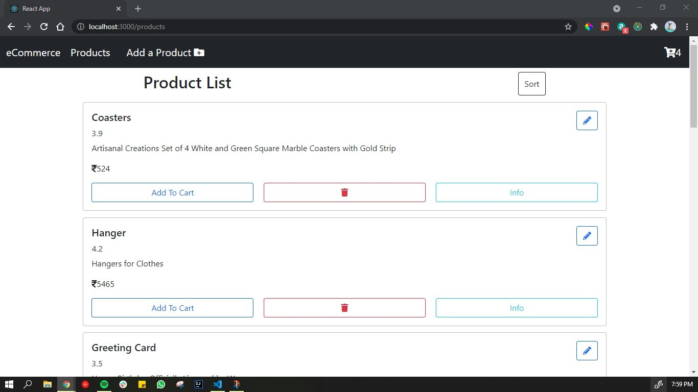
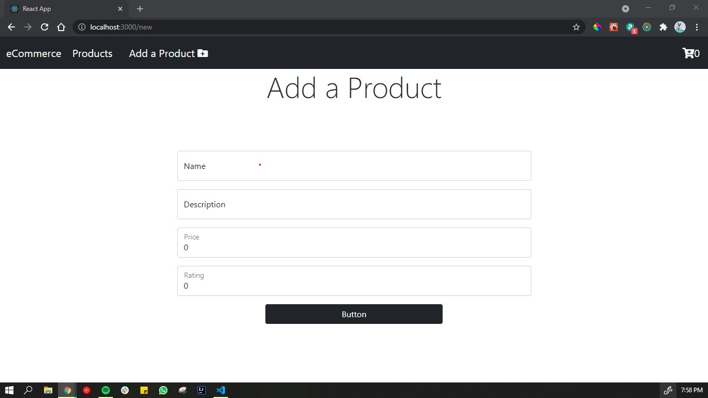
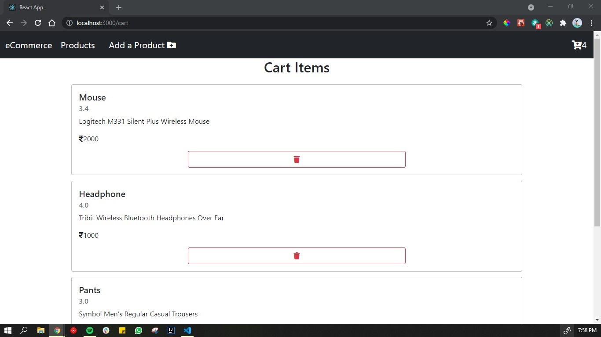
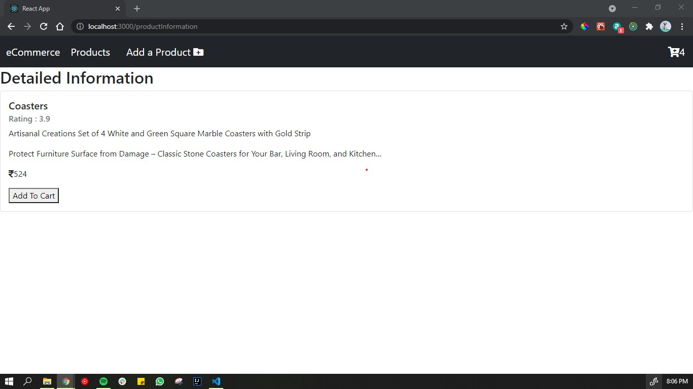
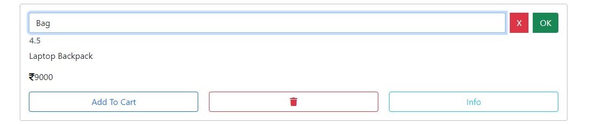
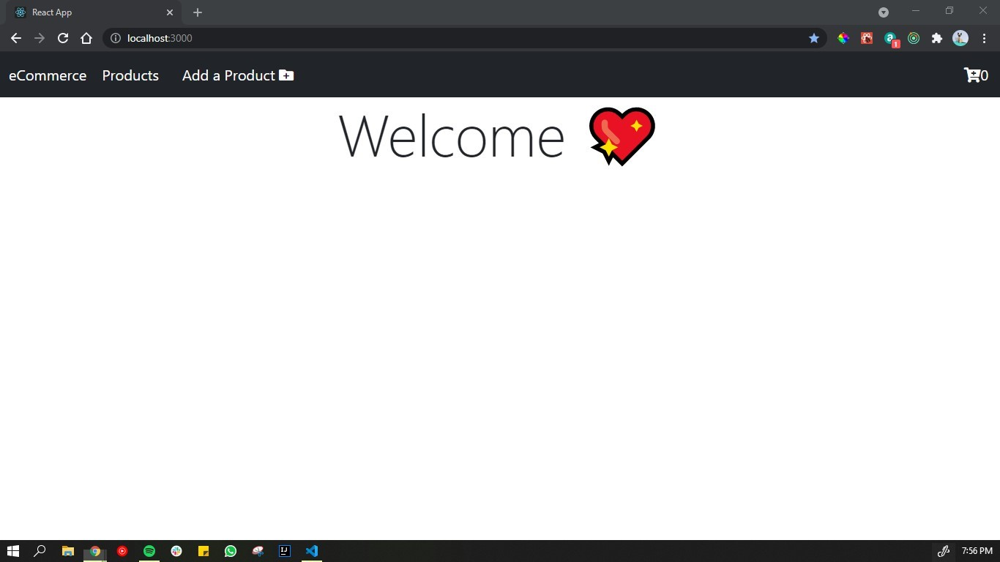

# Getting Started with Create React App
## View this web page at : https://nifty-mayer-12c900.netlify.app/

### Features
  * Each product is editable by clicking on the “pencil” button.
  * Each product is deletable.
  * On clicking on a sort button, product will sort in assending order accoriding the price and On clicking on the cross button product will unsort again.
  * User can add new products to the database, by going on the add new product page. 
  * User can add products to the cart and the cart will show number of items in it and also show every little detials about the product on it's page.

### Preview
  * Product List Page
    
  * Add new product page
    
  * cart page
    
  * Information about the product page 
    
  * onClick on pencil button
    
  * Home Page
    
